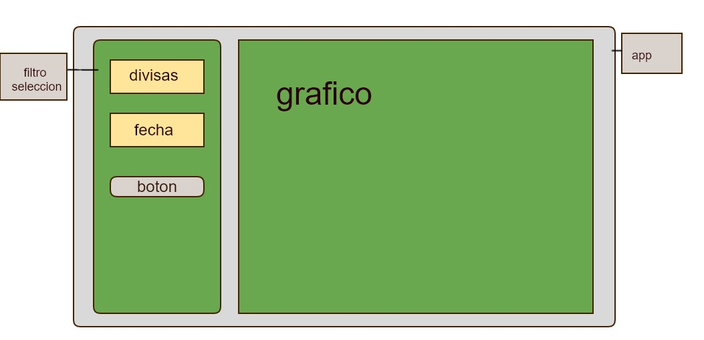

# DesafioGatBlac


## **```Dependencias y herramientas```**

<!-- 


 -->



## Especificación  del desafío
Para la evaluación  del desafío se debe realizar una aplicación web que permita a los usuarios conocerel valor  en pesos chilenos de las principales divisasy visualizarlas mediante  un gráfico. La consulta  se debe realizar seleccionando las divisas  y el rango de fechas.A continuación, los detalles  del funcionamiento: 
- PASO 1: 
  ### Selección de filtros: 
      - Se debe mostrar una lista que muestre  todas las divisas  disponibles, donde se puede seleccionarmás de una divisa.
      - Se debe mostrar filtros de fecha. (fecha desde y fecha hasta)
      - Al presionar un botón buscar se debe pintar en un gráfico los valores  en peso de las divisas, obteniendo  el valor  de las Apis de Gat-Blac y pasar a paso 2.
- PASO 2: 
   ### Gráfico con variación de valor:
      - Se debe visualizarun gráfico que muestre  el valor  de la divisa y su fluctuación en el rango de fechas que ingreso el usuario.
      - Al posicionar en una fecha se debe mostrar su variación de precio con respecto al día anterior.

### ASPECTOS TÉCNICOS A CONSIDERAR: 
      -  Se debe usar frameworks y tecnologías  que utilicen javascript.  Ejemplo:  Express, Angularjs,  Total.js -Existe  libertad para utilizar librerías de apoyo, por ejemplo  para el manejo  de grillas  o gráficos.
      -  Se deben instalar todas  las dependenciasdel proyectocon NPM  usando los flags  --save o --save-dev-Un desarrollo  real requiere de una especificación o diseño previo, de modo que se valorará  la incorporación de un diagrama o documento de apoyo.
      -  En un desarrollo  real es muy importante  el manejo  de errores por lo que se valorará  la consideración de este punto.
      -  Si bien el desafío es acotado, existe  la libertad de especificar elementos  no descritos que consideres relevantes  para el proyecto requerido.

### MATERIAL  DISPONIBLE: 
       Se debe utilizarlas Apis de Gat-Blacpara obtener los datos.
      -  Para los valores  diarios del dólar, uf, euro y utm usar http://gat-blac.com/indicator/api/indicators-Para 
      -  obtener las otras divisas y sus respectivos  valores  usar http://gat-blac.com/indicator/api/exchangeRate-Ejemplo  
      -  para filtrar por fecha: http://gat-blac.com/indicator/api/exchangeRate?date=2017-12-12
      -  También  se puede usar la librería en del npm https://www.npmjs.com/package/node-gat-blac-ap


This project was generated with [Angular CLI](https://github.com/angular/angular-cli) version 1.7.1.

## Development server

Run `ng serve` for a dev server. Navigate to `http://localhost:4200/`. The app will automatically reload if you change any of the source files.

## Code scaffolding

Run `ng generate component component-name` to generate a new component. You can also use `ng generate directive|pipe|service|class|guard|interface|enum|module`.

## Build

Run `ng build` to build the project. The build artifacts will be stored in the `dist/` directory. Use the `-prod` flag for a production build.

## Running unit tests

Run `ng test` to execute the unit tests via [Karma](https://karma-runner.github.io).

## Running end-to-end tests

Run `ng e2e` to execute the end-to-end tests via [Protractor](http://www.protractortest.org/).

## Further help

To get more help on the Angular CLI use `ng help` or go check out the [Angular CLI README](https://github.com/angular/angular-cli/blob/master/README.md).
